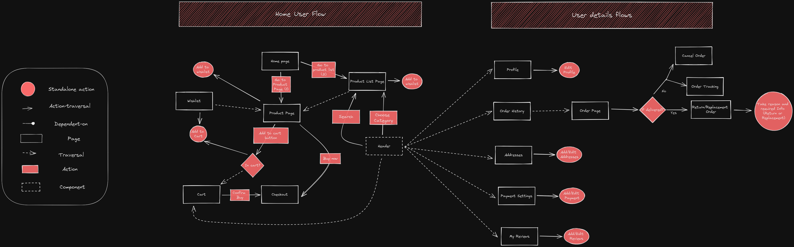
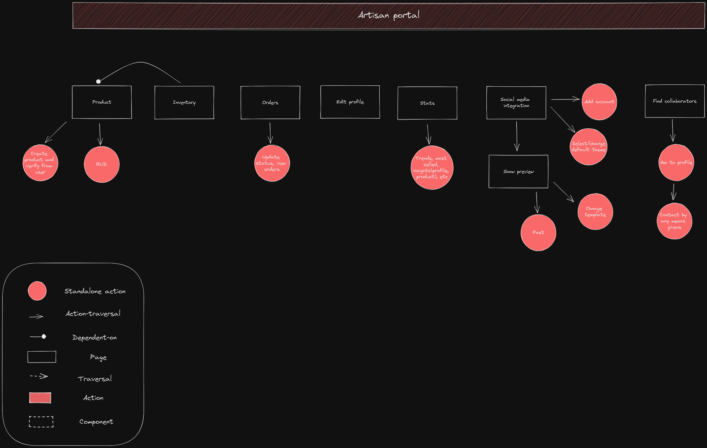
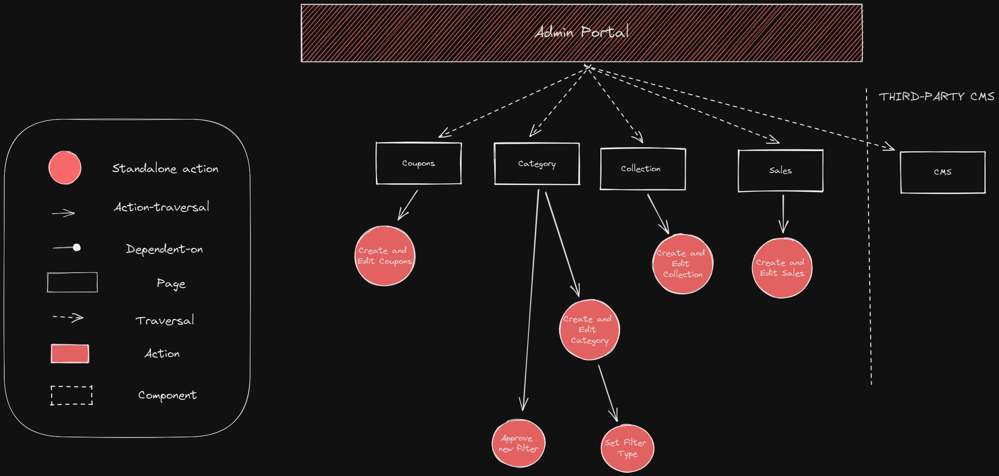

# Excalidraw
These are diagrams created with [Excalidraw](https://excalidraw.com).

They show the flow of the system. How the user will interact with the system.

## User Flow

User will interact with the system in the following ways:
- Login/Register
- View products
- Buy products
- Add products to cart
- Add products to wishlist
- Add reviews on products
- Rate products

## Artisan Flow

Artisan will interact with the system in the following ways:
- Login/Register
- View insights
- CRUD functionalities on products
- Search for colaborators
- Manage inventory
- Interact with social media through the system

## Admin Flow

Admin will interact with the system in the following ways:
- CRUD functionalities on categories
- CRUD functionalities on collections
- CRUD functionalities on coupons
- CRUD functionalities on sales
- Manage site content through CMS
  

